# RE-Vogue - A Django and React App

A Django, PostgresSQL, React full-stack app. My final project for General Assembly's Software Engineering Immersive.

### Developed by:

- Ornella Spada

## Deployment 

- I deployed this website using Heroku and it is available [here](https://re-vogue.netlify.app/). The free servers on Heroku sleep when they are not it use, so please allow a minute or two for them to wake up! 

 

## Concept 

**Re-VOGUE** has some similarities with the renowned fashion magazine website to which the aestetics of the platform is entirely inspired. This app is triggered by my passion about 90's fashion and the concept of circular economy and sustainability. Apart from reading about 90s fashion icons such as Carolyne Bessette, users can also BUY, RENT and ADD to WISHLIST their favourite garments that are taken from old collections inventories. This website is an avant-gard version of future high-end e-commerce websites and its aim is to make the second most polluting industry on Earth have a positive impact on the bioshere and reduce carbon dioxide emissions. 

## Project Brief
- One week to plan, build, and test our final project with a focus on cementing the learning from the past 11 weeks and showing off our new Python skills.
- Choose to work solo, as a pair, or as a group for the duration of the project.
- Review project proposal with our instructor so we can make sure it can be accomplished in the limited time we have.
- Build a full-stack application by making our own backend and front-end.
- Use a Python Django API, using Django REST Framework to serve our data from a PostgresSQL database.
- Consume our API with a separate frontend built with React.
- Build a complete product, which most likely means multiple relationships and CRUD functionality for at least a couple of models.
- Implement thoughtful user stories/wireframes that are significant enough to help us know which features are core MVP and which can be cut.
- Have a visually impressive design and be deployed online so it's publicly accessible.
- A git repository hosted on Github, with a link to your hosted project and frequent commits dating back to the very beginning of the project.

## Technologies Used 


- *Database:*
  - PostgresSQL
  - TablePlus
  - QuickDatabaseDiagrams
- *Backend:*
  - Python
  - Django
- *Frontend:*
  - JavaScript (ES6)
  - React.js
  - HTML5
  - CSS3 
- *Dependencies:*
  - djangorestframework
  - djangorestframework-camel-case
  - pyjwt
  - python-dotenv
  - Axios
  - react-router-dom
  - JSONWebToken
- *Development Tools:*
 - VS Code
 - Git + GitHub
 - Heroku
 - pylint

 ## Wireframes 

  **Excalidraw**
 

## Database Entity Relationship Diagram

**QuickDatabaseDiagrams**
 


## MVP

I kept out MVP fairly simple with the option to add future features later on.
My main requirements were:

- E-commerce platform for renting, selling or simply adding to wishlist high-end fashion clothes from old inventories.
- User authentication - Register & Login.
- A home page with articles on 90s style and icons.
- An Index Page for all runways including a search function based on Season, Year and Brand.
- A single garment view, with the option to buy, rent or add to the wishlist. 
- A review function, with the ability to delete the comment if the user has created the comment.
- A rent function where user can choose the date of the return.
- A personal gallery where user can see her history activity on the digital real estate.
- An aestetically stunning UI experience which is inspired by 90's minimalistic style and the pristine digital environment.

### Days 1 & 2 

- I started out by scaffolding the backend, adding the PostgresSQL database, writing seeds data, and installing dependencies. All of this went surprisingly smoothly, which showed me I had come a long way from our first projects.
- Using Django, I set up the "apps" for pies, users, reviews, categories, and basket items. These are quite quick to do with Django, so I had time to write the models, urls, and views for all of these.

#### Runway Model
```
class Runaway(models.Model):
    brand = models.CharField(max_length=50)
    year = models.CharField(max_length=50)
    season = models.CharField(max_length=50)
    image = models.CharField(max_length=200)
    sale_price = models.CharField(max_length=200)
    rent_price = models.CharField(max_length=200)
    description = models.TextField(max_length=350)
    favorited_by = models.ManyToManyField(
        'jwt_auth.User',
        related_name='favorites',
        blank=True
    )
  

    def __str__(self):
        return f'{self.brand} - {self.year}'

```
#### Rent Model
```
class Rental(models.Model):

    date_rented= models.DateField(max_length=250)
    date_returned= models.DateField(max_length=250, null=True)
    rented= models.BooleanField()
    runaway = models.ForeignKey(
        Runaway,
        related_name='rentals',
        on_delete=models.CASCADE
    )
    owner = models.ForeignKey(
        'jwt_auth.User',
        related_name='rentals',
        on_delete=models.CASCADE
    )
    def __str__(self):
        return f'Rental {self.id} on {self.runaway}'
```
#### Purchase Model
```
class Purchase(models.Model):

    date_purchased= models.DateField(max_length=250)
    runaway = models.ForeignKey(
        Runaway,
        related_name='purchases',
        on_delete=models.CASCADE
    )
    owner = models.ForeignKey(
        'jwt_auth.User',
        related_name='purchases',
        on_delete=models.CASCADE
    )
    def __str__(self):
        return f'Purchase {self.id} on {self.runaway}'

```
-  Next I began writing serializers for each app only as needed, and adding additional RESTful routes and serializers as I went along.

```
from rest_framework import serializers
from django.contrib.auth import get_user_model
from .models import Purchase, Rental, Runaway, Comment
User = get_user_model()

class UserSerializer(serializers.ModelSerializer):

    class Meta:
        model = User
        fields = ('id', 'username', 'profile_image' )

```
- I migrated each new app as I made changes.
- I tested each new RESTful route I added to the models using client.http as well as Django's built-in admin page.

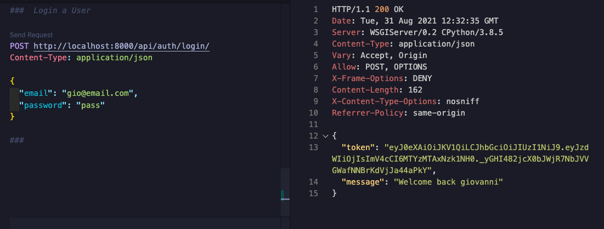

#### Manage pies on Django admin

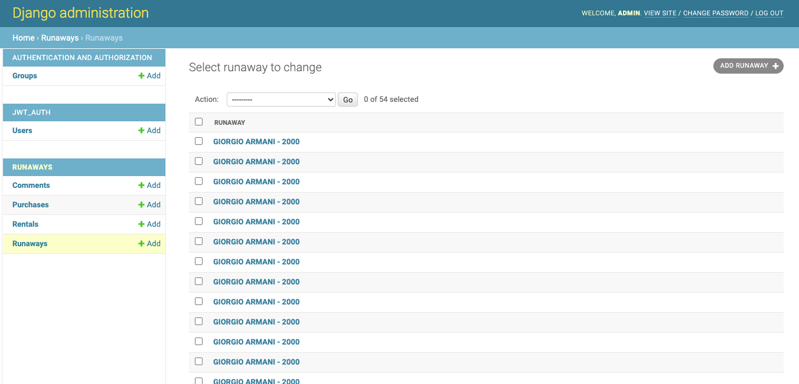

&nbsp;
&nbsp;
- I spent the evenings writing out seeds data, which I then converted to JSON in the mornings and re-seeded into the working backend.
- I also checked that the database was set up and seeded correctly with TablePlus.

&nbsp;
&nbsp;

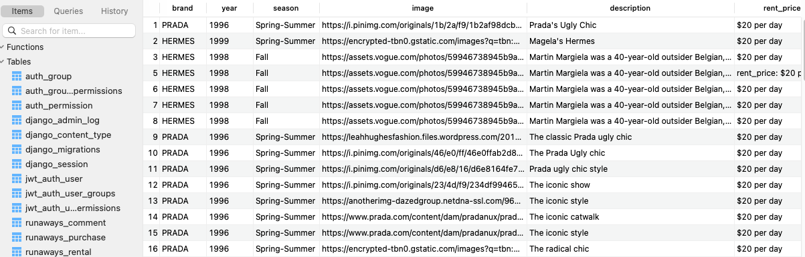

&nbsp;
&nbsp;
- Once all was working, I complicated the relationships as shown in our ERD and added a one-to-many relationship between our users and products, to use later as the 'favourite' feature.

&nbsp;
&nbsp;
```
class Rental(models.Model):

    date_rented= models.DateField(max_length=250)
    date_returned= models.DateField(max_length=250, null=True)
    rented= models.BooleanField()
    runaway = models.ForeignKey(
        Runaway,
        related_name='rentals',
        on_delete=models.CASCADE
    )
    owner = models.ForeignKey(
        'jwt_auth.User',
        related_name='rentals',
        on_delete=models.CASCADE
    )
    def __str__(self):
        return f'Rental {self.id} on {self.runaway}'

class Purchase(models.Model):

    date_purchased= models.DateField(max_length=250)
    runaway = models.ForeignKey(
        Runaway,
        related_name='purchases',
        on_delete=models.CASCADE
    )
    owner = models.ForeignKey(
        'jwt_auth.User',
        related_name='purchases',
        on_delete=models.CASCADE
    )
    def __str__(self):
        return f'Purchase {self.id} on {self.runaway}'

```
- I then adapted the My Gallery items GET and POST requests on the backend that would ensure the user only sees the items in the user's own My Gallery Page. 
```
class RegisterView(APIView):

    def post(self, request):
        user_to_create = UserSerializer(data=request.data)
        if user_to_create.is_valid():
            user_to_create.save()
            return Response(
                {'message: Registration Succesfull'},
                status=status.HTTP_201_CREATED
            )
        return Response(user_to_create.errors, status=status.HTTP_422_UNPROCESSABLE_ENTITY)

class LoginView(APIView):

    def post(self, request):
        email = request.data.get('email')
        password = request.data.get('password')

        try:
            user_to_login = User.objects.get(email=email)
        except User.DoesNotExist:
            raise PermissionDenied({'detail': 'Unauthorized'})

        if not user_to_login.check_password(password):
            raise PermissionDenied({'detail': 'Unauthorized'})

        expiry_time = datetime.now() + timedelta(days=7)
        token = jwt.encode(
            {'sub': user_to_login.id, 'exp':  int(expiry_time.strftime('%s'))},
            settings.SECRET_KEY,
            algorithm='HS256'
        )
        return Response(
            {'token': token, 'message': f'Welcome back {user_to_login.username}'}
        )

class ProfileView(APIView):

    def get(self, _request, pk):
        try :
            user = User.objects.get(pk=pk)
            serialized_user = PopulatedUserSerializer(user)
            return Response(serialized_user.data, status=status.HTTP_200_OK)
        except User.DoesNotExist:
            raise NotFound()
```
- I wrote out and tested error handling for all of the basic RESTful routes and finished building our backend after just two days. Thank you, Django!


### Days 3 & 4

- I was running ahead of schedule, so I took some time to re-evaluate our MVP and add in additional features from our wish list to the current sprint.
- I added a React front end to our project and divided up the router and component setup.
- I preferred to style using CSS, since I wanted the front-end to 'shine' in this project.
- I opted to use Axios for REST front end side as it makes it easier to edit and delete items from the database.
- I built the nav bar with flexbox:
 
 &nbsp;
 &nbsp;
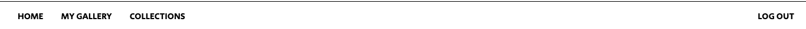
 &nbsp;
 &nbsp;

- I wrote GET requests to display the basic info about the garments on a Collections index page.

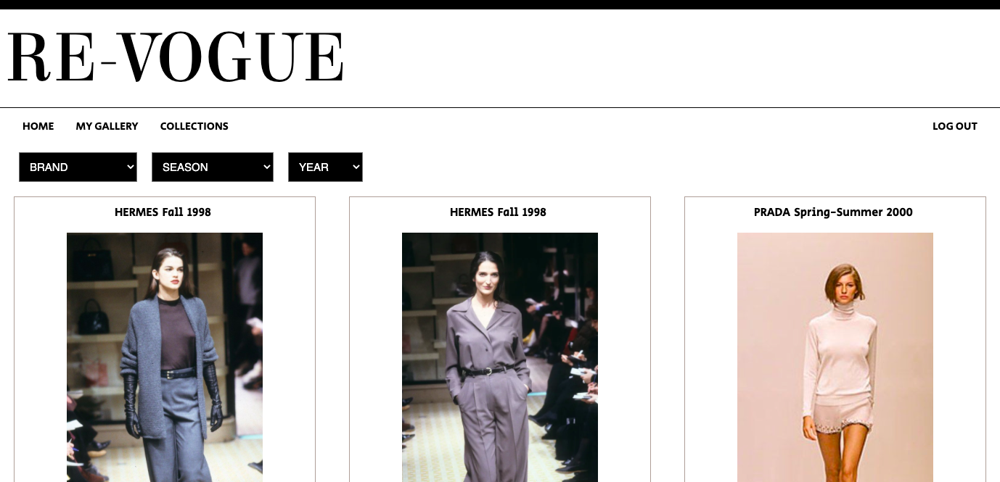

&nbsp;
&nbsp;

- And a separate request and page to display more detail about indivdual products on the Collections page if you click on one.

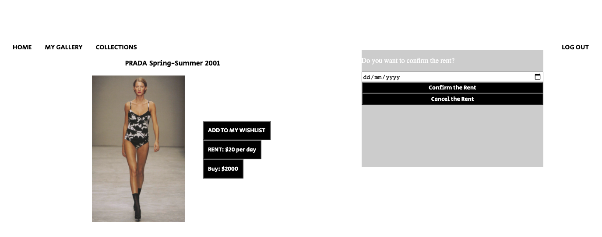

&nbsp;
&nbsp;

- Next, I built the ADD_TO_MY_WISHLIST/RENT/BUY buttons and separate wish list components. This required going back to the backend to write a special serializer for the users that would only require the favourites: [] array to get updated on a given user object in the database.
```
class UserSerializer(serializers.ModelSerializer):

    class Meta:
        model = User
        fields = ('id', 'username', 'profile_image' )

class RentSerializer(serializers.ModelSerializer):

    class Meta:
        model = Rental
        fields = '__all__'

class PurchaseSerializer(serializers.ModelSerializer):

    class Meta:
        model = Purchase
        fields = '__all__'

```
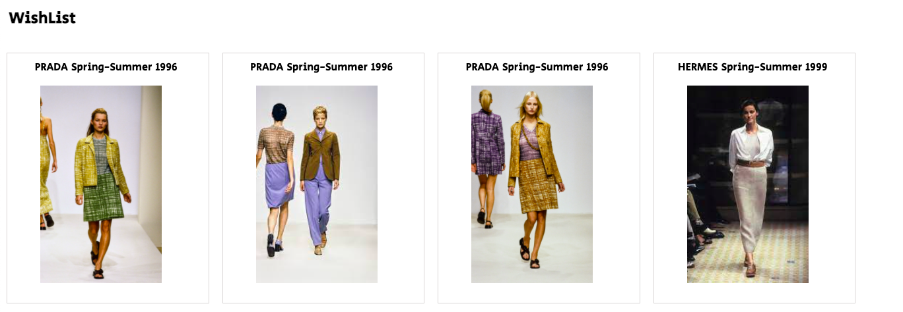
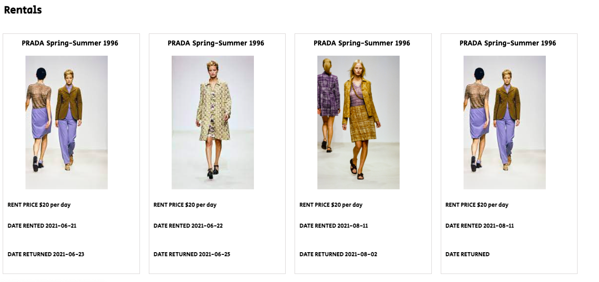
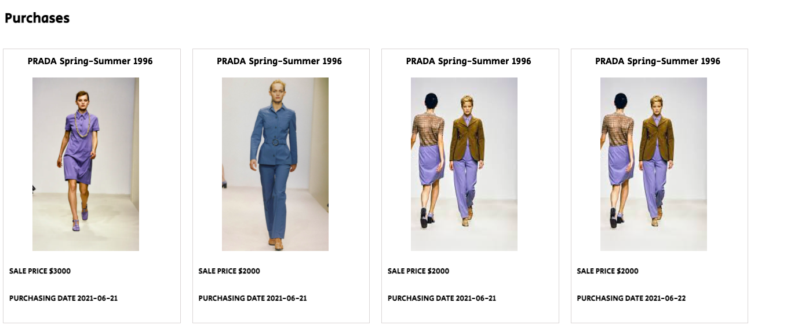

#### Functions for Buttons 
```
 const handleChange = (e) =>{
    setDateChoosen(e.target.value)
  }
  const handleBuyClick = () => {
    console.log('click3')
    setPopUpBuyOpen(true)
    setPopUpOpen(false)
  }

  const handleRent = async () =>{
    await addRent( runaway.id, { 'date_returned': dateChoosen } ) 
    setPopUpOpen(false)
    history.push('/favorite')
  }
  const handleBuy = async () =>{
    await addBuy(runaway.id) 
    history.push('/favorite')
  }
  const cancelBuy = async ()=>{
    setPopUpBuyOpen(false)
  }
  const cancelRent = async ()=>{
    setPopUpOpen(false)
  }

```

**JSX Code for Wish List**
```
{isLoggedIn && (
              <div>
                <button className='s-r-botton-rent' onClick={handleClick}> RENT: $20 per day </button>
          
              </div>
            )} 
            {isLoggedIn && (
              <div>
                <button className='s-r-botton-buy'onClick={handleBuyClick}> Buy: {runaway.sale_price}</button>
          
              </div>
            )} 

```
### Days 5 & 6

- I preferred to style as I went along to ensure we would not run out of time for CSS at the end of the week. Especially for a semi-clone site, I wanted to make sure it looked a lot like VOGUE with a vintage twist.
- I was very happy with how my styling for the homepage page turned out, much like the Vogue Homepage.

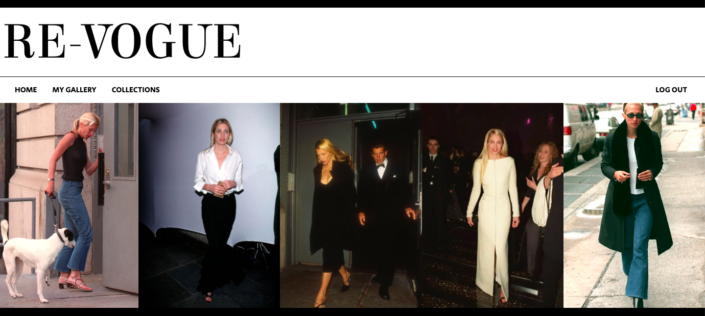

&nbsp;
&nbsp;

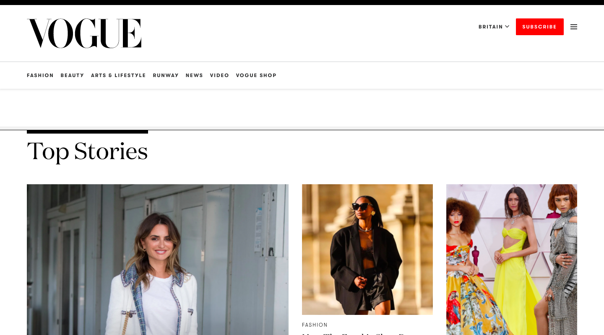

&nbsp;
&nbsp;

### Final Day

- I had just enough time at the end of the week to add some VOGUE-esque fonts to the site.
- I suddenly realised we didn't have a Logout button 30 minutes before the presentation and built one very quickly right before we presented our project. What a rush!
- I also was able to add the red shadow on pictures when you hover for which I am very proud of.

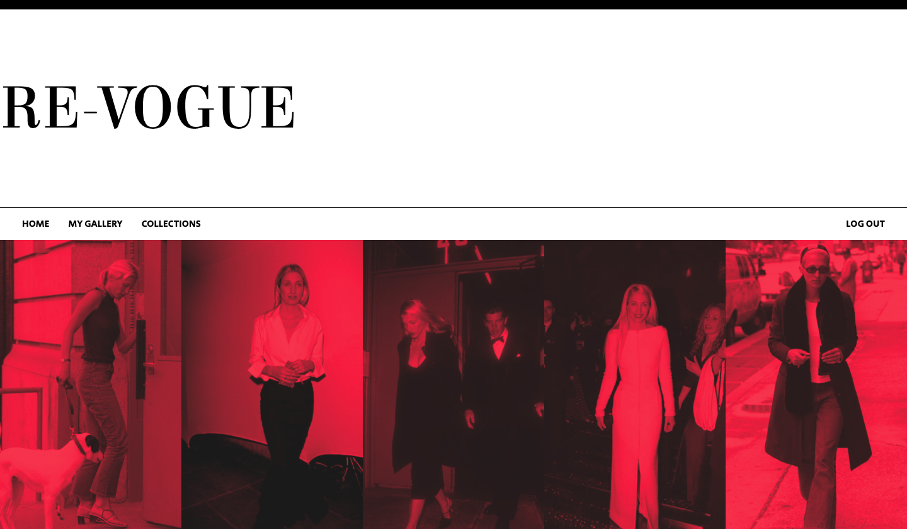

# Wins
- I was able to embed the logic to rent garments which is the most avant-garde functionality on this app.

```
{isLoggedIn && (
              <div>
                <button className='s-r-botton-rent' onClick={handleClick}> RENT: $20 per day </button>
          
              </div>
            )} 
            {isLoggedIn && (
              <div>
                <button className='s-r-botton-buy'onClick={handleBuyClick}> Buy: {runaway.sale_price}</button>
          
              </div>
            )} 
          </section>
        </div>
        <div className={ popUpOpen ? 'open' : 'closed' }>
          <div className='pop-up-frame'>
            <p>Do you want to confirm the rent?</p>
            <input type = 'date' onChange={handleChange}></input>
            <button className='button-pop-up' onClick={handleRent}>Confirm the Rent</button>
            <button className='button-pop-up' onClick={cancelRent}>Cancel the Rent</button>
          </div>
        </div>
```
- The user can choose the return date from a pop-up window 

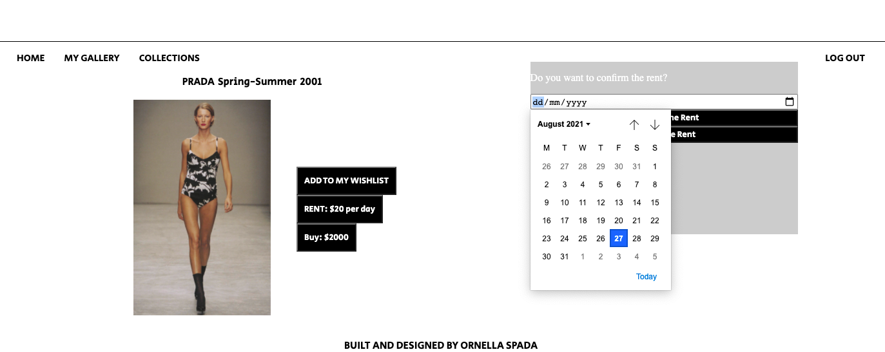

# Key Learnings 
- For the category filters on the ShowPage.js page, I initially tried to adapt code from another project I had worked on. However, this consumed a lot of time, and because I had set up our data and datatypes differently to the other project, this tactic proved to be more time spent than saved. I ended up starting from scratch to use a much simpler filter function on the runway state that stored all of the garments data from a GET request.

```
const filteredrunaways = runaways?.filter((runaway) => {
    return (
      (runaway.brand.toUpperCase() === selectedBrand.toUpperCase() || selectedBrand === 'Brands') &&
      (runaway.season === selectedSeason || selectedSeason === 'Season') &&
      (runaway.year === selectedYear.toString() || selectedYear === 'Year')
    )
  })

```
The takeaway for me was that it only makes sense to adapt existing code if it is similar enough to not need to write much. In this case, I spent much more time trying to untangle the old code than I eventually spent writing the new code.

# Feature WishList

- Finalize the Homepage with more pictures and create new pages to read articles. 
- Add the shopping basket at the top-right of the app.
- Calculate the rent price based on how many days the rent lasts.
- Add comments and reviews in the SigleShow page, where user can add and delete them. 
- Responsive design for smaller screens.

# Credits 

All fonts provided by [Google Fonts](https://fonts.google.com/)

Website inspired by [VOGUE](https://www.vogue.it/), [Balenciaga](https://www.balenciaga.com/it-it?ad=season&gclid=CjwKCAjwybyJBhBwEiwAvz4G7zrfK6zCn45ExTSBAZxnGwAA7oXugCqpJ7HfpTa5c2hG57FBH3hDZBoCDYwQAvD_BwE), [Lemaire](https://eu.lemaire.fr/) 


